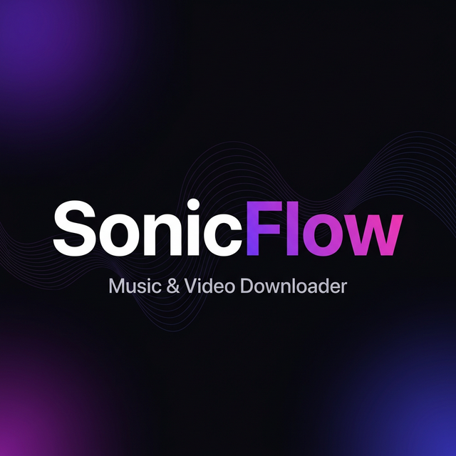
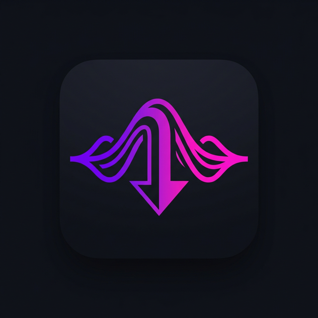
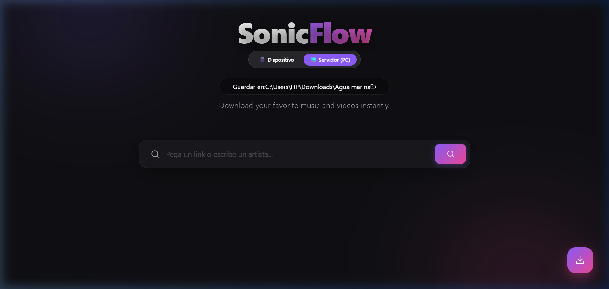

<div align="center">



<br/>



# SonicFlow

**Descargador de Música y Videos — YouTube & Spotify**

[](https://github.com/Ing-Maikel23/Descarga-Sonicflow/releases/latest)
[](https://github.com/Ing-Maikel23/Descarga-Sonicflow/releases/latest)
[](https://github.com/Ing-Maikel23/Descarga-Sonicflow/releases/latest)
[](LICENSE.txt)

<br/>

### 🎵 Descarga tus canciones y videos favoritos en segundos

<br/>

<a href="https://github.com/Ing-Maikel23/Descarga-Sonicflow/releases/latest/download/SonicFlow-Setup-1.0.0.exe">
  
</a>

<sub>Windows 10 / 11 · 64-bit · ~115 MB</sub>

</div>

---

## 📸 Capturas de pantalla

<div align="center">

</div>

---

## ✨ Características

<table>
<tr>
<td width="50%">

### 🔍 Búsqueda Inteligente
- Pega un link de **YouTube** o **Spotify**
- Escribe el nombre de un **artista** y encuentra sus mejores canciones
- Soporte para **playlists completas**
- Autocompletado con sugerencias en tiempo real

</td>
<td width="50%">

### ⬇️ Descargas Flexibles
- Descarga en **MP3** (audio de alta calidad)
- Descarga en **MP4** (video)
- **Cola de descargas** con hasta 2 simultáneas
- Elige la **carpeta de destino** con un clic

</td>
</tr>
<tr>
<td width="50%">

### 🎵 Reproductor Integrado
- **Previsualiza** cualquier canción antes de descargar
- Controles de **play, pausa y stop**
- Visualizador de audio animado
- Un solo reproductor activo a la vez

</td>
<td width="50%">

### 🖥️ App de Escritorio Nativa
- Instalador **exe** — doble clic y listo
- **Bandeja del sistema** (minimiza sin cerrar)
- Atajos en **Escritorio** y **Menú Inicio**
- Interfaz oscura moderna con diseño premium

</td>
</tr>
</table>

---

## 🚀 Cómo instalar

### Paso 1 — Descargar

Haz clic en el botón de descarga o ve a la sección [**Releases**](https://github.com/Ing-Maikel23/Descarga-Sonicflow/releases/latest) y descarga `SonicFlow-Setup-1.0.0.exe`.

### Paso 2 — Instalar

<details>
<summary><b>Ver instrucciones detalladas 📋</b></summary>

<br/>

1. Haz **doble clic** en `SonicFlow-Setup-1.0.0.exe`

2. Si Windows muestra una advertencia de SmartScreen, haz clic en **"Más información"** → **"Ejecutar de todas formas"**
   > 💡 Esta advertencia es normal para apps sin firma de código. SonicFlow es 100% seguro.

3. El asistente de instalación se abrirá:

   - Elige la **carpeta de instalación** (o deja la predeterminada)
   - Marca las casillas para crear **accesos directos** en el escritorio
   - Haz clic en **Instalar**

4. Al terminar, haz clic en **Finalizar** — SonicFlow abrirá automáticamente ✅

</details>

### Paso 3 — Usar

```
1. Abre SonicFlow desde el escritorio o el menú Inicio
2. Pega un link de YouTube/Spotify  -O-  escribe el nombre de un artista
3. Presiona el botón de búsqueda
4. Haz clic en el botón MP3 o MP4 para descargar
5. Encuentra tu archivo en C:\Users\TuNombre\Downloads\SonicFlow
```

---

## ⚙️ Requisitos del sistema

| Requisito | Mínimo |
|-----------|--------|
| **Sistema operativo** | Windows 10 / 11 (64-bit) |
| **RAM** | 4 GB |
| **Espacio en disco** | 500 MB libres |
| **Conexión a internet** | Requerida para buscar y descargar |
| **yt-dlp** | Incluido en la instalación |
| **FFmpeg** | Incluido en la instalación |

---

## ❓ Preguntas frecuentes

<details>
<summary><b>¿Es completamente gratis?</b></summary>
<br/>
Sí, SonicFlow es 100% gratuito y de código abierto bajo licencia MIT.
</details>

<details>
<summary><b>¿Por qué Windows muestra una advertencia al instalar?</b></summary>
<br/>
Windows SmartScreen muestra esta advertencia para aplicaciones que no tienen una firma de código de pago. SonicFlow es completamente seguro — puedes verificar el código fuente en <a href="https://github.com/Ing-Maikel23/musicFree">el repositorio del proyecto</a>. Haz clic en "Más información" → "Ejecutar de todas formas" para continuar.
</details>

<details>
<summary><b>¿Dónde se guardan las canciones descargadas?</b></summary>
<br/>
Por defecto en <code>C:\Users\TuNombre\Downloads\SonicFlow</code>. Puedes cambiar la carpeta desde la app haciendo clic en el ícono de carpeta junto a la ruta de guardado.
</details>

<details>
<summary><b>¿Puedo descargar playlists completas de Spotify?</b></summary>
<br/>
Sí. Pega el link de cualquier playlist pública de Spotify y SonicFlow buscará cada canción en YouTube para descargarla en MP3 con la mejor calidad disponible.
</details>

<details>
<summary><b>¿Cómo desinstalo SonicFlow?</b></summary>
<br/>
Ve a <b>Panel de Control → Programas → Desinstalar un programa</b>, busca "SonicFlow" y haz clic en Desinstalar. Tus canciones descargadas no se eliminarán.
</details>

---

## 🛡️ Aviso legal

SonicFlow es una herramienta de uso personal. Los usuarios son responsables de cumplir con los términos de servicio de YouTube, Spotify y otros proveedores de contenido. Solo descarga contenido del que tengas derecho a tener una copia.

---

## 📄 Licencia

Distribuido bajo la [Licencia MIT](LICENSE.txt). © 2025 SonicFlow.

---

<div align="center">

Hecho con ❤️ por **Ing-Maikel23**

⭐ Si te fue útil, dale una estrella al repo

<a href="https://github.com/Ing-Maikel23/Descarga-Sonicflow/releases/latest/download/SonicFlow-Setup-1.0.0.exe">
  
</a>

</div>
